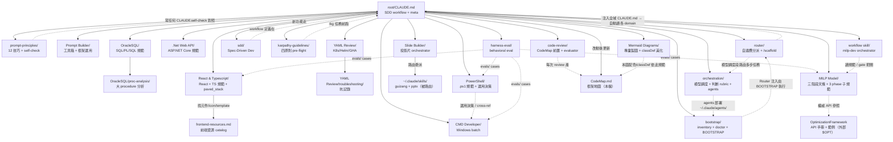

[TOC]

## File Index

| Domain | CLAUDE.md 路徑 | 行數 | 核心職責 | Slash Command |
|--------|---------------|------|---------|---------------|
| root | `CLAUDE.md` | 103 | SDD workflow + meta rules + 目錄導覽 + eval 觸發規則 | — |
| prompt-principles | `prompt-principles/CLAUDE.md` | 212 | 12 prompt 技巧 + self-check checklist | — |
| Prompt Builder | `Prompt Builder/CLAUDE.md` | 310 | 使用者寫 prompt 工具箱（框架選用 + 6 品質維度）| `/prompt-improve` |
| OracleSQL | `OracleSQL/CLAUDE.md` | 121 | Oracle SQL/PL/SQL 規範（schema、package、bulk DML）| — |
| OracleSQL/proc-analysis | `OracleSQL/proc-analysis/CLAUDE.md` | ~60 | 10K+ 行 procedure 靜態分析 + 筆記庫 | `/proc-analyze` |
| React & TypeScript | `React & Typescript/CLAUDE.md` | 129 | React 18+/19 + TS strict + paved_stack（Tailwind+cn / antd Hybrid / SWR+axios 資料層 / lucide）| — |
| React & TS/resources | `React & Typescript/frontend-resources.md` | 135 | 前端資源 catalog（元件/icon/template/動效/靈感）+ 決策樹 | — |
| .Net Web API | `.Net Web API/CLAUDE.md` | 103 | ASP.NET Core 8+ layered API（DI、async/await、DTO）| — |
| YAML Review | `YAML Review/CLAUDE.md` | 165 | K8s/Helm/ArgoCD/GHA YAML review + 10 點 checklist | `/k8s-review` |
| YAML/troubleshooting | `YAML Review/troubleshooting/CLAUDE.md` | ~30 | 公司內部 K8s 部署坑經驗庫 | — |
| sdd | `sdd/CLAUDE.md` | 93 | Spec-Driven Development（規格 → stub → 實作）| `/sdd` |
| karpathy-guidelines | `karpathy-guidelines/CLAUDE.md` | 137 | 四原則 pre-flight（Think/Simplicity/Surgical/Goal）| `/kg` |
| CMD Developer | `CMD Developer/CLAUDE.md` | 222 | Windows batch `.bat` 規範 + 9 大雷區 | `/cmd-dev` |
| PowerShell | `PowerShell/CLAUDE.md` | 147 | PowerShell `.ps1` 規範（編碼/BOM、CRLF、5.1 vs 7+、錯誤處理）+ `.bat` vs `.ps1` 選用決策 | —（Router 自動路由）|
| router | `router/CLAUDE.md` | 43 | 自適應分派層：`global-claude-block` 注入全域 CLAUDE.md + `/scaffold` + 模板（安裝改走 BOOTSTRAP）| `/scaffold` |
| harness-eval | `harness-eval/CLAUDE.md` | 37 | Behavioral eval：case 模板 + rule_refs STALE 檢查 + 生成/評判分離——框架的 unit test | `/harness-eval` |
| bootstrap | `bootstrap/CLAUDE.md` | 36 | 可攜層：`inventory.json` 部署清單 + 三方對帳；AI 適配 playbook 在 root `BOOTSTRAP.md`（77 行）| `/harness-doctor` |
| code-review | `code-review/code-review-command.md` | 276 | CodeMap 前置 + 獨立 evaluator subagent review（回灌，原無 source 孤兒）| `/code-review` |
| Slide Builder | `Slide Builder/CLAUDE.md` | 74 | 投影片 orchestrator：路由 pptx / guizang HTML + brand kit | slide-builder skill |
| Mermaid Diagrams | `Mermaid Diagrams/CLAUDE.md` | 103 | 專業 Mermaid 製圖：base theme + 語義 classDef 美化、語法防呆、mmdc/Kroki 匯出 | mermaid-diagrams skill |
| MILP Model | `MILP Model/CLAUDE.md` | 114 | MILP 建模天條：三階段 phase gate、命名（變數前綴 load-bearing 決定型別、OPTF001 enforce）、LHS/RHS 鐵則、禁 Hardcode、tuning gate（服務 OptimizationFramework） | milp-dev skill |
| MILP/API Guide | `MILP Model/optimfoundation-api-guide.md` | 660 | 端到端 API 開發規範：建專案 → Set/Parameter/Dataload → Variable → Objective/Constraint → Program.cs 唯一組裝點 → 寫實驗 → 解驗證協定 → API 速查/黑名單/常見錯誤 | — |
| MILP/Model Design | `MILP Model/Model Design/CLAUDE.md` | 124 | Phase 1 建模：4 階段降維、五段 Model.md（SET/PARAM/VAR/CONSTRAINT/OBJ）、程式轉譯 metadata、建模自驗 gate | — |
| MILP/Linearization Patterns | `MILP Model/Model Design/linearization-patterns.md` | 79 | constraint 8 類 canonical form + 非線性→線性 recipe（abs/max/min/fixed-charge/either-or）+ Big-M 鐵律 | — |
| MILP/Foundation Coding | `MILP Model/Foundation Coding/CLAUDE.md` | 171 | Phase 2 轉譯：六資料夾結構、Program.cs 唯一組裝點（禁 VariableCreate/BuildModel 包裝層）、generator 預設/手寫後路、Pool/取解 API、禁止 API 清單、fix loop ≤5、解驗證協定 | — |
| MILP/Foundation Tuning | `MILP Model/Foundation Tuning/CLAUDE.md` | 101 | Phase 3 調校：正確性 gate（引用解驗證協定）、三類觸發入口、IIS→Soft、Experiment API（fresh dataload+engine / verbose:false / 一次一旋鈕）、stop conditions | — |
| workflow skill | `workflow skill/SKILL.md` | 83 | milp-dev orchestrator：三階段推進 + gate 把關 + status.json resume | milp-dev skill |
| orchestration | `orchestration/CLAUDE.md` | 41 | 模型調度 domain：dispatch（派工/升降級/驗證不自驗）+ judgment rubric + 5 派工模板 + 3 自訂 agent（verifier/second-opinion/batch-worker）+ lessons/maintenance | —（Router 模型調度段路由）|

## Dependency Graph

```mermaid
graph TD
  ROOT["root/CLAUDE.md<br/>SDD workflow + meta"]

  PP["prompt-principles/<br/>12 技巧 + self-check"]
  PB["Prompt Builder/<br/>工具箱 + 框架選用"]
  OS["OracleSQL/<br/>SQL/PL/SQL 規範"]
  PA["OracleSQL/proc-analysis/<br/>大 procedure 分析"]
  RT["React & Typescript/<br/>React + TS 規範 + paved_stack"]
  FR["frontend-resources.md<br/>前端資源 catalog"]
  NA[".Net Web API/<br/>ASP.NET Core 規範"]
  YR["YAML Review/<br/>K8s/Helm/GHA"]
  YT["YAML Review/troubleshooting/<br/>坑記錄"]
  SDD["sdd/<br/>Spec-Driven Dev"]
  KG["karpathy-guidelines/<br/>四原則 pre-flight"]
  CMD["CMD Developer/<br/>Windows batch"]
  PS["PowerShell/<br/>.ps1 規範 + 選用決策"]
  RTR["router/<br/>自適應分派 + /scaffold"]
  HE["harness-eval/<br/>behavioral eval"]
  BS["bootstrap/<br/>inventory + doctor + BOOTSTRAP"]
  CR["code-review/<br/>CodeMap 前置 + evaluator"]
  SB["Slide Builder/<br/>投影片 orchestrator"]
  MD["Mermaid Diagrams/<br/>專業製圖 + classDef 美化"]
  GZ["~/.claude/skills/<br/>guizang + pptx（被路由）"]
  MILP["MILP Model/<br/>三階段天條 + 3 phase 子規範"]
  WS["workflow skill/<br/>milp-dev orchestrator"]
  ORCH["orchestration/<br/>模型調度 + 判斷 rubric + agents"]
  OPT["OptimizationFramework<br/>API 手冊 + 範例（外部 $OPT）"]
  CM["CodeMap.md<br/>框架地圖（本檔）"]

  ROOT -->|"寫任何 CLAUDE.md 先讀"| PP
  ROOT -->|"新功能走"| SDD
  ROOT --> OS
  ROOT --> RT
  RT -->|"找元件/icon/template"| FR
  ROOT --> NA
  ROOT --> YR
  ROOT --> KG
  ROOT --> PB
  ROOT --> CMD
  ROOT --> PS
  PS -.->|"選用決策 / cross-ref"| CMD
  ROOT --> RTR
  RTR -.->|"注入全域 CLAUDE.md → 自動讀各 domain"| ROOT
  ROOT --> HE
  ROOT --> BS
  ROOT --> CR
  HE -.->|"evals/ cases"| CMD
  HE -.->|"evals/ cases"| PS
  HE -.->|"evals/ cases"| RT
  HE -.->|"evals/ cases"| MILP
  ROOT --> MILP
  ROOT --> WS
  WS -.->|"讀規範 / gate 把關"| MILP
  MILP -.->|"權威 API 參照"| OPT
  BS -.->|"Router 注入由 BOOTSTRAP 執行"| RTR
  CR -.->|"每次 review 產"| CM
  ROOT --> ORCH
  RTR -.->|"模型調度段路由多步任務"| ORCH
  ORCH -.->|"agents 部署 ~/.claude/agents/"| BS
  ROOT --> SB
  ROOT --> MD
  ROOT -->|"改動後更新"| CM
  MD -.->|"本圖配色/classDef 依此規範"| CM
  OS --> PA
  YR --> YT
  SB -->|"路由委派"| GZ
  PP -.->|"self-check 對照"| ROOT
  SDD -.->|"workflow 定義在"| ROOT
  KG -.->|"/kg 任務前跑"| ROOT
```

## Key Rules Index

| 規則 | 位置 | 觸發時機 |
|------|------|---------|
| 寫/改 CLAUDE.md 前先讀 prompt-principles | root `<critical_notes>` | 任何 CLAUDE.md 異動 |
| 改動後更新 `CodeMap.md` | root `<critical_notes>` | 讀 domain CLAUDE.md 或框架改動後 |
| 非 trivial 功能 MUST 走 SDD | root `<workflow>` + sdd/ | 新功能開發 |
| Karpathy `/kg` pre-flight | karpathy-guidelines/ | 任何非 trivial 編碼任務開始前 |
| 先問假設再動工 | karpathy-guidelines/ 原則 1 | 模糊任務 |
| 規格確認前不動 production code | sdd/ `<critical_notes>` | 開發前 |
| 12 點 self-check 跑一次 | prompt-principles/ `<self-check>` | 寫完 prompt / CLAUDE.md |
| 大 procedure → `/proc-analyze` | OracleSQL/ `<common_tasks>` | 讀 10K+ 行 PL/SQL |
| CodeMap 前置 → code review | Global CLAUDE.md（user）| `/code-review` 或「幫我看 code」|
| 撞 K8s 坑 30 分鐘內補 troubleshooting | YAML Review/ `<common_tasks>` | 部署後踩坑 |
| 改有 evals/ 的 domain 規範後跑 `/harness-eval` | root `<critical_notes>` + harness-eval/ | 規範改動後 |
| 部署清單只改 `bootstrap/inventory.json` | bootstrap/ `<critical_notes>` | 加裝 command / skill |
| BOOTSTRAP Phase 1 列清單等確認才寫檔 | `BOOTSTRAP.md` `<rules>` | 新機適配 / 增量部署 |
| evaluator findings 經主 session 驗證才輸出 | code-review command | `/code-review` |
| 三階段 phase gate：模型未確認 NEVER 產 `.cs` | MILP Model/ `<critical_notes>` | 建模題目（OptimizationFramework） |
| LHS/RHS 鐵則：NEVER 移項 / 改號 / 翻轉方向 | MILP Model/ `<critical_notes>` | Coding / Tuning 任何模型轉譯 |
| 掃 repo / 讀 3 檔+ / 批次改檔 → 派 subagent 不自己做 | orchestration/dispatch.md | 任何多步任務 |
| 驗收派 fresh-context `verifier`，NEVER 自驗 | orchestration/dispatch.md | 交付宣告完成前 |
| 踩坑當 session 寫 `lessons.md`，第 2 次才提升為條文 | orchestration/maintenance.md | 重試 2 輪 / verifier FAIL / 使用者糾正 |

## Coverage Assessment

| Domain | 完整度 | 已知 Gap / 風險點 |
|--------|--------|-----------------|
| prompt-principles | ✅ 完整 | — |
| sdd | ✅ 完整 | — |
| karpathy-guidelines | ✅ 完整 | — |
| OracleSQL | ✅ 完整 | proc-analysis 筆記庫（`notes/`）靠人工維護，易過時 |
| React & TypeScript | ✅ 完整 | 已補 paved_stack + frontend-resources catalog；仍缺 testing pattern（Vitest / Testing Library）|
| .Net Web API | ⚠️ 可補 | 缺 integration test pattern（WebApplicationFactory 用法）|
| YAML Review | ✅ 完整 | troubleshooting case 數靠 on-call 補，無 SLA 可能落後 |
| Prompt Builder | ✅ 完整 | 框架選擇決策樹豐富；LLM 判斷 prompt 品質的範例相對薄 |
| CMD Developer | ✅ 完整 | Windows-only；`.ps1` / 跨平台 → 見 PowerShell domain（已建）|
| PowerShell | ✅ 完整 | 純規範；靠 router 注入全域 CLAUDE.md 自動套用 `.ps1` |
| router | ✅ 完整 | Router 區塊已注入 `~/.claude/CLAUDE.md`、`/scaffold` 已裝；安裝 / 重灌改走 root `BOOTSTRAP.md`（scripts/ 已廢棄刪除 2026-07-04）|
| harness-eval | ✅ cases 齊 | 3 domain（CMD / PowerShell / React&TS）各 3 cases，rule_refs 錨點全數驗證；三 domain 首輪 eval 全跑 **9/9 PASS**（2026-07-04，spec ②驗收過） |
| bootstrap | ✅ 完整 | inventory.json（12 items 驗證過）+ doctor 七項 + BOOTSTRAP playbook；本機 dogfood 完成（3 command 熱載入 + manifest v2 + 2 skills 部署 2026-07-04）|
| code-review | ✅ 回灌 + 改造 | 原無 source 孤兒已解；Phase 2 改獨立 evaluator subagent；write-tutorial / research-note 仍為孤兒（backlog）|
| Slide Builder | ✅ skill 已裝 | slide-builder skill 已部署 `~/.claude/skills/`（2026-07-04）；pptx skill 仍需自 anthropics/skills 手動複製；HTML 路由 guizang 已就緒 |
| Mermaid Diagrams | ✅ 完整 | mmdc 匯出需本機 Node；無 Node 走 Kroki（敏感圖勿送公開 Kroki，改自架） |
| MILP Model | ✅ 建模科學化強化 + API guide | 2026-07-05 吸收 OMG_LLM Reasoning paper pipeline：Phase 1 改 4 階段降維、新增 linearization-patterns.md、Foundation Coding 加解驗證協定；2026-08-01 新增 `optimfoundation-api-guide.md`（端到端 660 行）並把 paved path 改為「Program.cs 唯一組裝點、不開 VariableCreate/BuildModel 包裝層」，Foundation Coding / Tuning / milp-dev SKILL 已同步；evals 6 個未含新 paved path，`/harness-eval milp-model` 待跑（規範改動未回歸）|
| workflow skill | ✅ 新建 | milp-dev 已登錄 inventory（skill-milp-dev）；需重跑 BOOTSTRAP 適配部署到 `~/.claude/skills/milp-dev/` |
| YAML/troubleshooting | ⚠️ 薄 | Case 數量不明，建議定期盤點 |
| orchestration | ✅ 新建（2026-07-08 Fable session） | 尚無 `evals/`——首次改 dispatch/judgment 前先建 2 cases（LETTER §2）；agents 部署需重開 session 生效；LETTER §1 待決清單需使用者處理 |
